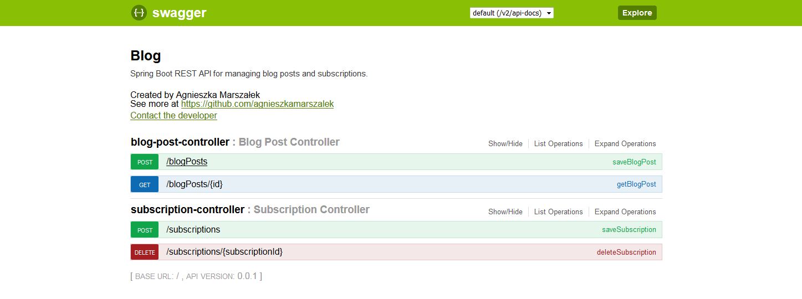

# Blog server
REST application for managing blog posts and subscriptions. <br/>
If subscribed author adds post, service will send request to notification service. 

#### Build and run Java application (localhost:8080)

```sh
$ cd blog_server && mvn clean install
```
```sh
$ java -jar -Dspring.profiles.active=remote target/blog_server-0.0.1-SNAPSHOT.jar
```

# Notification server
Simple service to sending emails with notifications. <br/>

#### Build and run Java application (localhost:8090)

```sh
$ cd notification_server && mvn clean install
```
```sh
$ java -jar -Dspring.profiles.active=remote target/notification_server-0.0.1-SNAPSHOT.jar
```


More information in swagger (localhost:8080/swagger-ui.html):

